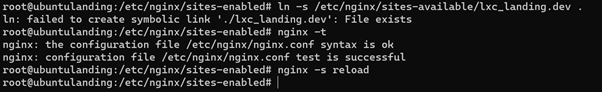
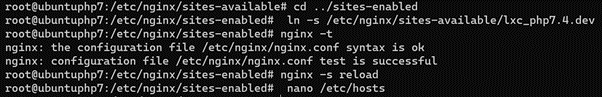
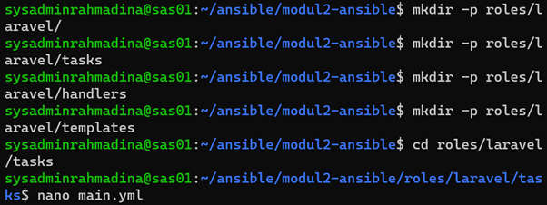
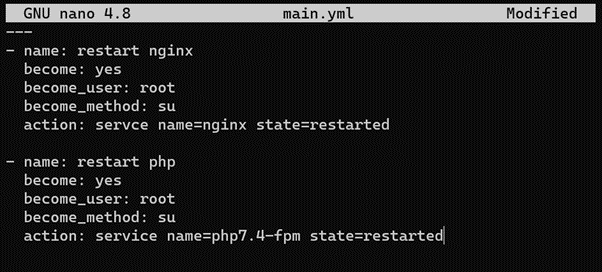
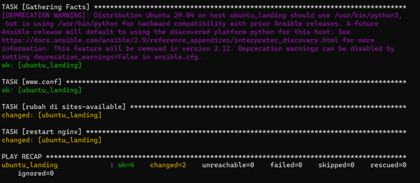

# Keadaan

Gilang dan adit yang telah menyelesaikan virtualisasi server sesuai dengan hasil rapat mereka dengan tim programmer akan mencoba menginstall beberapa aplikasi yang akan digunakan. Setelah sukses menginstall framework codeigniter beserta php5.6 dan membuat server database dengan mariadb serta phpmyadmin. Mereka akan mencoba menginstall 2 framework lain yang dibutuhkan. Tentunya, mereka akan membuat skrip instalasi secara automasi dengan ansible. Mereka cukup jumawa karena telah lulus SAS pak Aldo dengan nilai A.

Namun mereka diberi tahu lagi oleh programmer senior, pak Dzul. dimana ternyata ubuntu 18.04 Bionic sudah tidak disupport lagi untuk php7.4. Lantas mereka akan menggantinya dengan ubuntu 20.04 focal.

# Soal Praktikum

1. Rubah LXC landing dengan ubuntu focal (destroy n create, same ip, same name)
2. Rubah LXC php7 dengan ubuntu focal (destroy n create, same ip, same name)


4. vm.local/

   - akan diinstall menggunakan framework laravel 8 pada lxc_landing

   - laravel 8 menggunakan php7.4

   - tentunya harus bisa connect ke server database (lxc_mariadb)

   - semua script instalasi tidak ada yang manual (kecuali openssh-server), harus menggunakan ansible, termasuk membuat database (sungguh mereka jumawa sekali)

4. vm.local/blog

   - install wordpress terbaru pada lxc_php7.4
   - wordpress menggunakan php7.4
   - tentunya harus bisa connect ke server database (lxc_mariadb)
   - semua script instalasi tidak ada yang manual (kecuali openssh-server), harus menggunakan ansible, termasuk membuat database (sungguh mereka jumawa sekali)
   - Bisa masuk dashboard


---
Answer
---

# Laporan Praktikum 2 - Sistem Administrasi Server 
Report by :
1. RAHMADINA OKTAVIANA (1202190016)
2. RISKA APRILIA (1202190007)
#
Soal Praktikum dapat diakses [Klik disini.](https://github.com/aldonesia/Sistem-Administrasi-Server-2021/blob/master/modul-2/soal_praktikum.md)
#
## Keadaan

Gilang dan adit yang telah menyelesaikan virtualisasi server sesuai dengan hasil rapat mereka dengan tim programmer akan mencoba menginstall beberapa aplikasi yang akan digunakan. Setelah sukses menginstall framework codeigniter beserta php5.6 dan membuat server database dengan mariadb serta phpmyadmin. Mereka akan mencoba menginstall 2 framework lain yang dibutuhkan. Tentunya, mereka akan membuat skrip instalasi secara automasi dengan ansible. Mereka cukup jumawa karena telah lulus SAS pak Aldo dengan nilai A.

Namun mereka diberi tahu lagi oleh programmer senior, pak Dzul. dimana ternyata ubuntu 18.04 Bionic sudah tidak disupport lagi untuk php7.4. Lantas mereka akan menggantinya dengan ubuntu 20.04 focal.

## Soal Praktikum

1. Rubah LXC landing dengan ubuntu focal (destroy n create, same ip, same name)
- Hapus ubuntu_landing_backup terlebih dahulu kemudian hapus ubuntu_landing. Jangan lupa ketika ingin menghapus, pastikan LXC sudah berhenti.
  ```
  #stop ubuntu_landing
  sudo lxc-stop -n ubuntu_landing
  #hapus ubuntu_landing
  sudo lxc-destroy ubuntu_landing_backup
  sudo lxc-destroy ubuntu_landing
  #cek lagi apakah sudah terhapus semua
  sudo lxc -ls -f
  ```
  

- Buat lxc ubuntu_landing dg versi 20
  ```
  sudo lxc-create -n ubuntu_landing -t download -- --dist ubuntu --release focal fossa --arch amd64 --foce-cache --no-validate --server images.linuxcontainers.org
  ```
  
- Setting autostart
  ```
  sudo su
  echo "lxc.start.auto = 1" >> /var/lib/lxc/ubuntu_landing/config
  exit
  ```
  
- Install nginx
  ```
  sudo lxc-start -n ubuntu_landing
  sudo lxc-attach -n ubuntu_landing
  sudo apt install nginx nginx-extras
  ```
- Install nano terlebih dahulu, lalu edit ip nya menjadi static
  ```
  sudo nano /etc/netplan/10-lxc.yaml
  ```
  
  
  ```
  sudo netplan apply
  ifconfig
  ```
  
- Buat file di sites-available dengan nama lxc_landing.dev
  ```
  cd /etc/nginx/sites-available
  touch lxc_landing.dev
  nano lxc_landing.dev
  ```
  
  
  
- Buat symlink di sites-enabled yang mengarah ke sites-available
  ```
  cd ../sites-enabled
  ln -s /etc/nginx/sites-available/lxc_landing.dev .
  nginx -t
  nginx -s reload
  ```
  
- Setting etc/hosts
  ```
  nano /etc/hosts
  ```
  
  
- Masuk ke var html
  ```
  cd /var/www/html
  mkdir lxc_landing
  cp index.nginx-debian.html lxc_landing/index.html
  cd lxc_landing
  nano index.html
  ```
  
  
  
- Cek curl
  ```
  curl -i http://lxc_landing.dev
  ```
  
- Install and setting ssh
  ```
  sudo apt install openssh-server python
  nano /etc/ssh/sshd_config
  #setting config menjadi
  PermitRootLogin yes
  RSAAuthentication yes
  #end of config
  service sshd restart
  #set password
  passwd
  exit
  ```
- cek ssh root 
  ```
  ssh root@lxc_landing.dev
  exit
  ```
  
  
- Backup and autostart 0
  ```
  sudo lxc-stop -n ubuntu_landing
  sudo lxc-copy -n ubuntu_landing -N ubuntu_landing_backup -sKD
  sudo lxc-ls -f
  ```
  
  
  
  
2. Rubah LXC php7 dengan ubuntu focal (destroy n create, same ip, same name)
- Destroy ubuntu
  ```
  sudo su
  lxc-stop -n ubuntu_php7.4
  lxc-stop -n ubuntu_php7.4_backup
  lxc-destroy ubuntu_php7.4_backup
  lxc-destroy ubuntu_php7.4
  lxc-ls -f
  ```
  
  
  ###
- Install
  ```
  sudo lxc-create -n ubuntu_php7.4 -t download -- --dist ubuntu --release focal fossa --arch amd64 --foce-cache --no-validate --server images.linuxcontainers.org
  ```
  

- Install nginx
  ```
  sudo lxc-start -n ubuntu_php7.4
  sudo lxc-attach -n ubuntu_php7.4
  sudo apt install nginx nginx-extras
  ```
  
  
  
- Install nano terlebih dahulu, lalu edit ip nya menjadi static
  ```
  sudo nano /etc/netplan/10-lxc.yaml
  ```
  
  ```
  sudo netplan apply
  ifconfig
  ```
  
- Setting autostart
  ```
  echo "lxc.start.auto = 1" >> /var/lib/lxc/ubuntu_landing/config
  exit
  ```
  
- Buat file di sites-available dengan nama lxc_php7.4.dev
  ```
  cd /etc/nginx/sites-available
  touch lxc_php7.4.dev
  nano lxc_php7.4.dev
  ```
  
  
- Buat symlink di sites-enabled yang mengarah ke sites-available
  ```
  cd ../sites-enabled
  ln -s /etc/nginx/sites-available/lxc_7.4.dev .
  nginx -t
  nginx -s reload
  ```
  
- Setting etc/hosts
  ```
  nano /etc/hosts
  ```
  
- Masuk ke var html
  ```
  cd /var/www/html
  mkdir lxc_php7.4
  cp index.nginx-debian.html lxc_php7.4/index.html
  cd lxc_landing
  nano index.html
  ```
  
  
- Cek curl
  ```
  curl -i http://lxc_php7.4.dev
  ```
  
- Install dan setting ssh 
  ```
  sudo lxc-attach -n ubuntu_php7.4
  sudo apt install openssh-server python
  nano /etc/ssh/sshd_config
  #setting config menjadi
  PermitRootLogin yes
  RSAAuthentication yes
  #end of config
  service sshd restart
  #set password
  passwd
  exit
  ```
- Jalankan ssh root nya
  ```
  ssh root@lxc_php7.dev
  ```
  
- Backup dan matikan autostart nya
  ```
  sudo su
  lxc-stop -n ubuntu_php7.4
  lxc-copy -n ubuntu_php7.4 -N ubuntu_php7.4_backup -sKD
  sudo lxc-ls -f
  ```
  
  ###
3. vm.local/
- Edit hosts di modul2-ansible
  ```
  cd ~/ansible/modul2-ansible
  nano hosts
  ```
  
  
- Coba ping
  ```
  cd ~/ansible -i hosts -m ping all -k 
  ```
  
- Update
  ```
  ssh root@ubuntu_landing
  sudo apt update
  ```
  
- buat file deploy-laravel.yml
  ```
  cd ~/ansible/modul2-ansible
  nano deploy-laravel.yml
  ```
  
- isi dari deploy-laravel.yml
  ```
  - hosts: landing
  vars:
    domain: lxc_landing.dev
  roles:
    - { role: laravel }
  ```
  
- Buat roles/Laravel berisi:
  ```
  mkdir -p roles/laravel/tasks
  mkdir -p roles/laravel/handlers
  mkdir -p roles/laravel/templates
  ```
  
  
- Isi main.yml pada tasks
  ```
  ---
  - name: delete apt chache
    become: yes
    become_user: root
    become_method: su
    command: rm -vf /var/lib/apt/lists/*
  - name: install requirement dpkg to install php7.4
    become: yes
    become_user: root
    become_method: su
    apt: name={{ item }} state=latest update_cache=true
    with_items:
      - ca-certificates
      - apt-transport-https
      - curl
      - python-apt
      - software-properties-common
  - name: Add Php Repository 7.4
    apt_repository:
      repo: "ppa:ondrej/php"
      state: present
    filename: php.list
    update_cache: true
  
  - name: install nginx php7.4
    become: yes
    become_user: root
    become_method: su
    apt: name={{ item }} state=latest update_cache=true
    with_items:
     - nginx
     - nginx-extras
     - php7.4
     - php7.4-fpm
     - php7.4-curl
     - php7.4-mbstring
     - php7.4-xml
     - php7.4-gd
     - php7.4-opcache
     - php7.4-zip
  
  - name: Download and install Composer
    shell: curl -sS https://getcomposer.org/installer | php
    args:
      chdir: /usr/src/
      creates: /usr/local/bin/composer
      warn: false
    become: yes
  - name: Add Composer to global path
    copy:
      dest: /usr/local/bin/composer
      group: root
      mode: '0755'
      owner: root
      src: /usr/src/composer.phar
      remote_src: yes
    
  - name: Composer create project
    become_user: root
    composer:
      command: create-project
      arguments: laravel/laravel landing
      working_dir: /var/www/html
      prefer_dist: yes
    environment:
      COMPOSER_NO_INTERACTION: "1"
     
   - name: set APP_URL
     lineinfile:
       dest=/var/www/html/landing/.env
       regexp='^APP_URL='
       line=APP_URL=http://vm.local
      
   - name: set DB_HOST
     lineinfile:
       dest=/var/www/html/landing/.env
       regexp='^DB_HOST='
       line=DB_HOST=10.0.3.200
      
   - name: set DB_DATABASE
     lineinfile:
       dest=/var/www/html/landing/.env
       regexp='^DB_DATABASE='
       line=DB_DATABASE=landing
      
   - name: set DB_USERNAME
     lineinfile:
        dest=/var/www/html/landing/.env
        regexp='^DB_USERNAME='
        line=DB_USERNAME=admin
      
   - name: set DB_PASSWORD
     lineinfile:
       dest=/var/www/html/landing/.env
       regexp='^DB_PASSWORD='
       line=DB_PASSWORD=108642
      
    - name: change permission storage
      command: chmod -R 777 /var/www/html/landing/storage
      
    - name: Copy landing.conf
      template:
        src=templates/landing
        dest=/etc/nginx/sites-available/{{ domain }}
      vars:
        servername: '{{ domain }}'
      
    - name: Delete another nginx config
      become: yes
      become_user: root
      become_method: su
      command: rm -f /etc/nginx/sites-enabled/*
      
    - name: Symlink landing.conf
      command: ln -sfn /etc/nginx/sites-available/{{ domain }} /etc/nginx/sites-enabled/{{ domain }}
      notify:
        restart nginx
      
    - name: Write {{ domain }} to /etc/hosts
      lineinfile:
        dest: /etc/hosts
        regexp: '.*{{ domain }}$'
        line: "127.0.0.1   {{ domain }}"
        state: present
  ```
  

- Isi landing pada templates

  
  ```
  server {
      listen 80;
      server_name {{ domain }};
      root /var/www/html/landing/public;
      index index.php;
      charset utf-8;
      location / {
          try_files $uri $uri/ /index.php?$query_string;
      }
      location = /favicon.ico { access_log off; log_not_found off; }
      location = /robots.txt  { access_log off; log_not_found off; }
      error_page 404 /index.php;
      location ~ \.php$ {
          fastcgi_pass unix:/var/run/php/php7.4-fpm.sock;
          fastcgi_index index.php;
          fastcgi_param SCRIPT_FILENAME $realpath_root$fastcgi_script_name;
          include fastcgi_params;
      }
      location ~ /\.(?!well-known).* {
          deny all;
      }
  }
  ```
- Isi main.yml pada handlers
  
  
  
  ```
  ---
  - name: stop apache2
    become: yes
    become_user: root
    become_method: su
    action: service name=apache2 state=stopped
    
  - name: restart nginx
    become: yes
    become_user: root
    become_method: su
    action: service name=nginx state=restarted
    
  - name: restart php
    become: yes
    become_user: root
    become_methode: su
    action: service name=php7.4-fpm state=restarted
  ```
  
- Jalankan
  ```
  cd ~/ansible/modul2-ansible
  ansible-playbook -i hosts deploy-laravel.yml -k
  ```
- Hasil

  

4. vm.local/blog
- Edit deploy-wp
  ```
  cd ~/ansible/modul2-ansible
  nano deploy-wp.yml
  ```
  
- Buat roles wp
  ```
  mkdir -p roles/wp
  mkdir -p roles/wp/handlers
  mkdir -p roles/wp/tasks
  mkdir -p roles/wp/templates
  ```
  
- Isi pada /tasks/main.yml
  ```
  ---
  - name: delete apt chache
    become: yes
    become_user: root
    become_method: su
    command: rm -vf /var/lib/apt/lists/*
  
  - name: install requirement dpkg to install php7.4
    become: yes
    become_user: root
    become_method: su
    apt: name={{ item }} state=latest update_cache=true
    with_items:
      - ca-certificates
      - apt-transport-https
      - curl
      - python-apt
      - software-properties-common
    
  - name: Add Php Repository 7.4
    apt_repository:
      repo: "ppa:ondrej/php"
      state: present
      filename: php.list
      update_cache: true
     
  - name: install nginx php7.4
    become: yes
    become_user: root
    become_method: su
    apt: name={{ item }} state=latest update_cache=true
    with_items:
      - nginx
      - nginx-extras
      - curl
      - wget
      - php7.4
      - php7.4-fpm
      - php7.4-curl
      - php7.4-xml
      - php7.4-gd
      - php7.4-opcache
      - php7.4-mbstring
      - php7.4-zip
      - php7.4-json
      - php7.4-cli
      - php7.4-mysqlnd
      - php7.4-xmlrpc
      
  - name: wget wordpress
    shell: wget -c http://wordpress.org/latest.tar.gz
      
  - name: tar latest.tar.gz
    shell: tar -xvzf latest.tar.gz
    
  - name: copy folder wordpress
    shell: cp -R wordpress /var/www/html/blog
    
  - name: chmod
    become: yes
    become_user: root
    become_method: su
    command: chmod 775 -R /var/www/html/blog/
    
  - name: copy .wp-config.conf
    template:
      src=templates/wp.conf
      dest=/var/www/html/blog/wp-config.php
      
  - name: copy wp.local
    template:
      src=templates/wp.local
      dest=/etc/nginx/sites-available/{{ domain }}
    vars:
      servername: '{{ domain }}'
  - name: Delete another nginx config
    become: yes
    become_user: root
    become_method: su
    command: rm -f /etc/nginx/sites-enabled/*
    
  - name: Symlink sites-available wordpress
    command: ln -sfn /etc/nginx/sites-available/{{ domain }} /etc/nginx/sites-enabled/{{ domain }}
    notify:
      - restart nginx
  - name: Write {{ domain }} to /etc/hosts
    lineinfile:
      dest: /etc/hosts
      regexp: '.*{{ domain }}$'
      line: "127.0.0.1   {{ domain }}"
      state: present
  - name: enable module php mbstring
    command: phpenmod mbstring
    notify:
      - restart php
  ```

  
  
- Isi pada /templates/wp.conf
  ```
  <?php
  /**
  * The base configuration for WordPress
  *
  * The wp-config.php creation script uses this file during the installation.
  * You don't have to use the web site, you can copy this file to "wp-config.php"
  * and fill in the values.
  *
  * This file contains the following configurations:
  *
  * * MySQL settings
  * * Secret keys
  * * Database table prefix
  * * ABSPATH
  *
  * @link https://wordpress.org/support/article/editing-wp-config-php/
  *
  * @package WordPress
  */
  define( 'WP_HOME', 'http://vm.local/blog' );
  define( 'WP_SITEURL', 'http://vm.local/blog' );
  // ** MySQL settings - You can get this info from your web host ** //
  /** The name of the database for WordPress */
  define( 'DB_NAME', 'blog' );
  /** MySQL database username */
  define( 'DB_USER', 'admin' );
  /** MySQL database password */
  define( 'DB_PASSWORD', '108642' );
  /** MySQL hostname */
  define( 'DB_HOST', '10.0.3.200:3306' );
  /** Database charset to use in creating database tables. */
  define( 'DB_CHARSET', 'utf8' );
  /** The database collate type. Don't change this if in doubt. */
  define( 'DB_COLLATE', '' );
  /**#@+
  * Authentication unique keys and salts.
  *
  * Change these to different unique phrases! You can generate these using
  * the {@link https://api.wordpress.org/secret-key/1.1/salt/ WordPress.org secret-key service}.
  *
  * You can change these at any point in time to invalidate all existing cookies.
  * This will force all users to have to log in again.
  *
  * @since 2.6.0
  */
  define( 'AUTH_KEY',         'put your unique phrase here' );
  define( 'SECURE_AUTH_KEY',  'put your unique phrase here' );
  define( 'LOGGED_IN_KEY',    'put your unique phrase here' );
  define( 'NONCE_KEY',        'put your unique phrase here' );
  define( 'AUTH_SALT',        'put your unique phrase here' );
  define( 'SECURE_AUTH_SALT', 'put your unique phrase here' );
  define( 'LOGGED_IN_SALT',   'put your unique phrase here' );
  define( 'NONCE_SALT',       'put your unique phrase here' );
  /**#@-*/
  /**
  * WordPress database table prefix.
  *
  * You can have multiple installations in one database if you give each
  * a unique prefix. Only numbers, letters, and underscores please!
  */
  $table_prefix = 'wp_';
  /**
  * For developers: WordPress debugging mode.
  *
  * Change this to true to enable the display of notices during development.
  * It is strongly recommended that plugin and theme developers use WP_DEBUG
  * in their development environments.
  *
  * For information on other constants that can be used for debugging,
  * visit the documentation.
  *
  * @link https://wordpress.org/support/article/debugging-in-wordpress/
  */
  define( 'WP_DEBUG', false );
  /* Add any custom values between this line and the "stop editing" line. */
  /* That's all, stop editing! Happy publishing. */
  /** Absolute path to the WordPress directory. */
  if ( ! defined( 'ABSPATH' ) ) {
        define( 'ABSPATH', __DIR__ . '/' );
  }
  /** Sets up WordPress vars and included files. */
  require_once ABSPATH . 'wp-settings.php';
  ```

  
  
- Isi pada /templates/wp.local
  ```
  server {
      listen 80;
      server_name {{ domain }};
      root /var/www/html/blog;
      index index.php;
      charset utf-8;
      location / {
          try_files $uri $uri/ /index.php?$query_string;
      }
      location ~ \.php$ {
          try_files $uri =404;
          fastcgi_split_path_info ^(.+\.php)(/.+)$;
          fastcgi_pass unix:/var/run/php/php7.4-fpm.sock;
          fastcgi_index index.php;
          fastcgi_param SCRIPT_FILENAME $realpath_root$fastcgi_script_name;
          include fastcgi_params;
      }
  }
  ```

  

- Isi /handlers/main.yml
  ```
  ---
  - name: restart nginx
  become: yes
  become_user: root
  become_method: su
  action: service name=nginx state=restarted
  - name: restart php
  become: yes
  become_user: root
  become_method: su
  action: service name=php7.4-fpm state=restarted
  ```
  
  
- Jalankan
  ```
  cd ~/ansible/modul2-ansible
  ansible-playbook -i hosts deploy-wp.yml -k
  ```
- Hasil
  
  
  
  
  
  
  
  

5. Soal Tambahan
- buat file ubah-socket.yml
  ```
  - hosts: landing
    tasks:
    - name: www.conf
      lineinfile:
         dest: /etc/php/7.4/fpm/pool.d/www.conf
         regexp: '^listen = /run/php/php7.4-fpm.sock'
         line: listen = 127.0.0.1:9001
         state: present
    - name: rubah di sites-available
      lineinfile:
         dest: /etc/nginx/sites-available/lxc_landing.dev
         regexp: '^        fastcgi_pass'
         line:         fastcgi_pass 127.0.0.1:9001;
    - name: restart nginx
      become: yes
      become_user: root
      become_method: su
      action: service name=nginx state=restarted
  ```
- buat file ubah-socket-php7.yml
  ```
  - hosts: php7
    tasks:
    - name: www.conf
      lineinfile:
         dest: /etc/php/7.4/fpm/pool.d/www.conf
         regexp: '^listen = /run/php/php7.4-fpm.sock'
         line: listen = 127.0.0.1:9001
         state: present
    - name: rubah di sites-available
      lineinfile:
         dest: /etc/nginx/sites-available/lxc_php7.dev
         regexp: '^        fastcgi_pass'
         line:         fastcgi_pass 127.0.0.1:9001;
    - name: restart nginx
      become: yes
      become_user: root
      become_method: su
      action: service name=nginx state=restarted
    - name: restart php
      become: yes
      become_user: root
      become_method: su
      action: service name=php7.4-fpm state=restarted
  ```
- Jalankan
  ```
  cd ~/ansible/modul2-ansible
  ansible-playbook -i hosts ubah-socket.yml -k
  ``` 
  
  
  
  


<p align="right">(<a href="#UTS">back to top</a>)</p>
