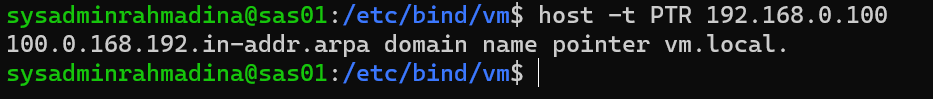
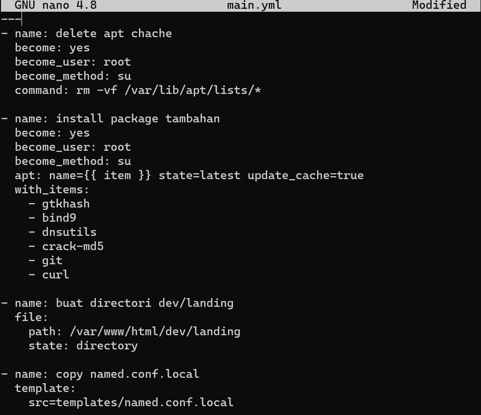
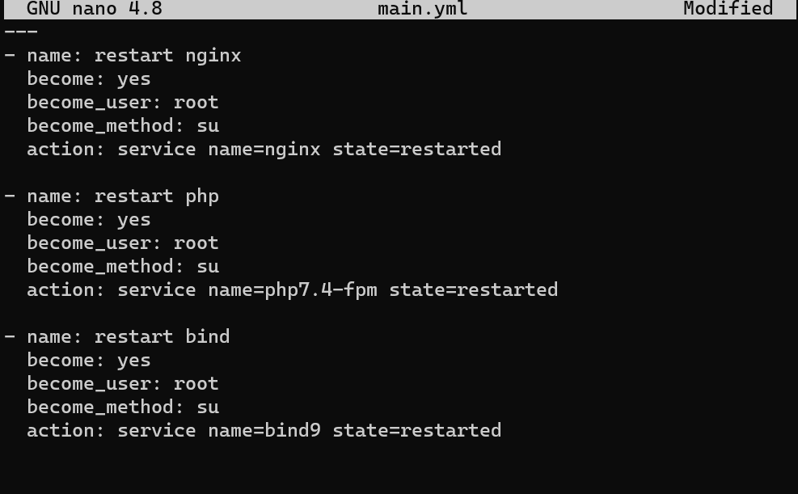
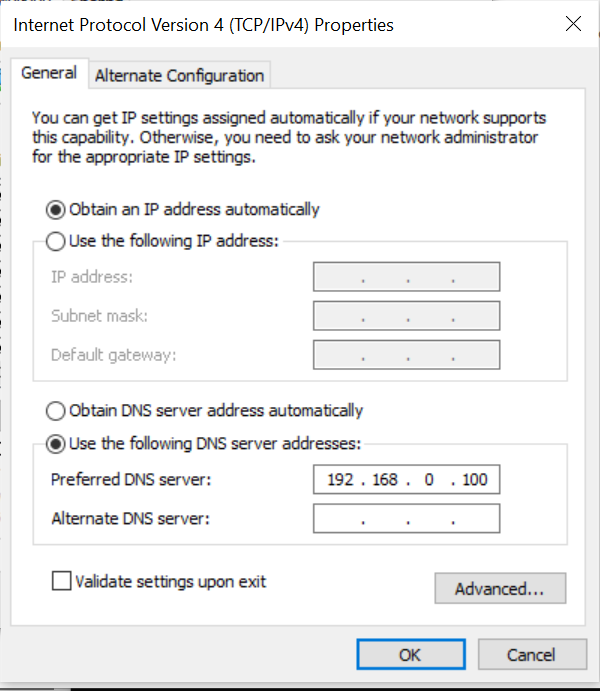

---
# Kelompok 7
# Rahmadina Oktaviana (1202190016)
# Riska Aprilia (1202190007)
# System Administrasi Server Modul dan Praktikum 3
---

# Modul 3 - DNS, & Load Balancer

## DNS (*Domain Name Server*)
### Pengertian
DNS (Domain Name System) adalah sistem penamaan untuk semua device (smartphone, computer, atau network) yang terhubung dengan internet. DNS Server berfungsi menerjemahkan nama domain menjadi alamat IP. DNS dibuat guna untuk menggantikan sistem penggunaan file host yang dirasa tidak efisien.
### Cara Kerja

Client akan meminta alamt IP dari suatu domain ke DNS server. Jika pada DNS server data alamat IP dari DNS server tersebut ada maka akan di return alamat IP nya kembali menuju client. Jika DNS server tersebut tidak memiliki alamat IP dari domain tersebut maka dia akan bertanya kepada DNS server yang lain sampai alamat domain itu ditemukan.	
### Aplikasi DNS Server
aplikasi BIND9 sebagai DNS server, karena BIND(Berkley Internet Naming Daemon) adalah DNS server yang paling banyak digunakan dan juga memiliki fitur-fitur yang cukup lengkap.
### List DNS Record
| Tipe          | Deskripsi                     |
| ------------- |:-----------------------------|
| A             | Memetakan nama domain ke alamat IP (IPv4) dari komputer hosting domain|
| AAAA          | AAAA record hampir mirip A record, tapi mengarahkan domain ke alamat Ipv6|
| CNAME         | Alias ​​dari satu nama ke nama lain: pencarian DNS akan dilanjutkan dengan mencoba lagi pencarian dengan nama baru|
| NS            | Delegasikan zona DNS untuk menggunakan authoritative name servers yang diberikan|
| PTR           | Digunakan untuk Reverse DNS (Domain Name System) lookup|
| SOA           | Mengacu server DNS yang mengediakan otorisasi informasi tentang sebuah domain Internet|
| TXT           | Mengijinkan administrator untuk memasukan data acak ke dalam catatan DNS, catatan ini juga digunakan di spesifikasi Sender Policy Framework|
### SOA (Start of Authority)
Adalah informasi yang dimiliki oleh suatu DNS zone.

| Nama          | Deskripsi                     |
| ------------- |:-----------------------------|
| Serial        | Jumlah revisi dari file zona ini. Kenaikan nomor ini setiap kali file zone diubah sehingga perubahannya akan didistribusikan ke server DNS sekunder manapun|
| Refresh       | Jumlah waktu dalam detik bahwa nameserver sekunder harus menunggu untuk memeriksa salinan baru dari zona DNS dari nameserver utama domain. Jika file zona telah berubah maka server DNS sekunder akan memperbarui salinan zona tersebut agar sesuai dengan zona server DNS utama|
| Retry         | Jumlah waktu dalam hitungan detik bahwa nameserver utama domain (atau server) harus menunggu jika upaya refresh oleh nameserver sekunder gagal sebelum mencoba refresh zona domain dengan nameserver sekunder itu lagi|
| Expire        | Jumlah waktu dalam hitungan detik bahwa nameserver sekunder (atau server) akan menahan zona sebelum tidak lagi mempunyai otoritas|
| Minimum       | Jumlah waktu dalam hitungan detik bahwa catatan sumber daya domain valid. Ini juga dikenal sebagai TTL minimum, dan dapat diganti oleh TTL catatan sumber daya individu|
| TTL           | (waktu untuk tinggal) - Jumlah detik nama domain di-cache secara lokal sebelum kadaluarsa dan kembali ke nameserver otoritatif untuk informasi terbaru|

### Latihan
#### Persiapan Konfigurasi
1. Hapus hosts vm.local dari hostfile windows
	
2. Buka Ubuntu VM, pastikan network menggunakan bridge network
3. Tambahkan konfigurasi nginx untuk virtual hosts vm.local
	
4. Edit etc/hosts

	
	
5. Restart nginx
	```bash
	sudo service nginx restart
	```
6. Check Konfigurasi
	```bash
	curl -i http://vm.local
	curl -i http://www.wm.local
	```
	
	
	
7. Catat IP VM
	```bash
	ip addr show enp0s3
	```
	
	
	kita catat bahwa IP VM kita adalah 172.20.10.4	

#### Instalasi DNS Master
DNS master adalah DNS utama yang akan digunakan sebagai penerjemah alamat domain menjadi alamat ip. untuk instalasi, silahkan buka ubuntu VM. DNS Master menggunakan aplikasi bind9, untuk langkah instalasi hanya perlu menuliskan
```bash
sudo apt install bind9
```


#### Konfigurasi DNS Master
1. Pembuatan Domain
	- Lakukan perintah untuk merubah konfigurasi bind9 seperti dibawah ini
		```bash
		sudo nano /etc/bind/named.conf.local
		```
		
		
		
	- Daftarkan domain vm.local
		```bash
		zone "vm.local" {
			type master;
			file "/etc/bind/vm/vm.local";
		};
		```
		
	- Buat folder vm di dalam /etc/bind
		```bash
		sudo mkdir /etc/bind/vm
		```
		
		
		
	- Copykan file db.local pada path /etc/bind ke dalam folder vm yang baru saja dibuat dan ubah namanya menjadi vm.local
		```bash
		sudo cp /etc/bind/db.local /etc/bind/vm/vm.local
		```
		
		
	- Kemudian buka file vm.local dan edit seperti gambar berikut dengan IP ubuntu VM masing-masing kelompok:
	- 
		
	- Restart bind9 dengan perintah
		```bash
		sudo service bind9 restart
		```
		
		
		
2. Reverse DNS (Record PTR)

	Jika pada pembuatan domain sebelumnya DNS server kita bekerja menerjemahkan string domain vm.local kedalam alamat IP agar dapat dibuka, maka Reverse DNS atau Record PTR digunakan untuk menerjemahkan alamat IP ke alamat domain yang sudah diterjemahkan sebelumnya.
	- Edit file /etc/bind/named.conf.local pada wsl
		```bash
		sudo nano /etc/bind/named.conf.local
		```
		
		
	- Lalu tambahkan konfigurasi berikut ke dalam file named.conf.local
		```bash
		zone "0.168.192.in-addr.arpa" {
		    type master;
		    file "/etc/bind/vm/0.168.192.in-addr.arpa";
		};
		```
		
	- Copykan file db.local pada path /etc/bind ke dalam folder jarkom yang baru saja dibuat dan ubah namanya menjadi 0.168.192.in-addr.arpa
		```bash
		sudo cp /etc/bind/db.local /etc/bind/vm/0.168.192.in-addr.arpa
		```
		
		
		*Keterangan 10.20.172 adalah 3 byte pertama IP VM yang dibalik urutan penulisannya*
	- Edit file 10.20.172.in-addr.arpa menjadi seperti gambar di bawah ini
		```bash
		sudo nano /etc/bind/vm/0.168.192.in-addr.arpa
		```
		
		
		```bash
		;
		; BIND data file for local loopback interface
		;
		$TTL    604800
		@       IN      SOA     vm.local. root.vm.local. (
					      2         ; Serial
					 604800         ; Refresh
					  86400         ; Retry
					2419200         ; Expire
					 604800 )       ; Negative Cache TTL
		;
		0.168.192.in-addr.arpa. IN      NS      vm.local.
		100                     IN      PTR     vm.local.
		```		
		
		
		
	- Kemudian restart bind9 dengan perintah
		```bash
		sudo service bind9 restart
		```
		
		
	- Rubah DNS wsl dengan ip wsl, dan beri comment pada default dns
		```bash
		sudo apt install dnsutils
		```
		
		
		
		```bash
		sudo nano /etc/resolv.conf
		```
		
		
	- Untuk mengecek apakah konfigurasi sudah benar atau belum, lakukan perintah berikut 
		```bash
		sudo apt install dnsutils
		host -t PTR "IP VM"
		```
		
		
		
3. Record CNAME

	Record CNAME adalah sebuah record yang membuat alias name dan mengarahkan domain ke alamat/domain yang lain.
	- edit file /etc/bind/vm/vm.local
		```bash
		sudo nano /etc/bind/vm/vm.local
		```
		
	- Kemudian restart bind9 dengan perintah
		```bash
		sudo service bind9 restart
		```
		
		
		
		
	- Lalu cek dengan melakukan host -t CNAME www.vm.local atau ping www.vm.local. Hasilnya harus mengarah ke host dengan IP VM.
	
	
	
	
	
4. DNS Forwarder
	DNS Forwarder digunakan untuk mengarahkan DNS Server ke IP yang ingin dituju.
	- Edit file /etc/bind/named.conf.options
	- Uncomment pada bagian ini
		```bash
		forwarders {
		    8.8.8.8;
		};
		```
	- Comment pada bagian ini
		```bash
		// dnssec-validation auto;
		```
	- Dan tambahkan
		```bash
		allow-query{any;};
		```
		
		
	- Kemudian restart bind9 dengan perintah
		```bash
		sudo service bind9 restart
		```
		
		
	- Harusnya jika nameserver pada file /etc/resolv.conf di client diubah menjadi IP WSL maka akan di forward ke IP DNS google yaitu 8.8.8.8 dan bisa mendapatkan koneksi.
5. Setting nameserver pada client
	- Untuk linux, mengganti dns hanya perlu merubah /etc/resolv.conf
	- Untuk Windows, ikuti step dibawah ini
		+ buka control panel
		+ pilih network and internet
		+ pilih network and sharing center
			
		+ pilih change adapter setting
			
		+ jikalau menggunakan wifi, silahkan click kanan -> properties pada wifi adapter, jikalau menggunakan lan, silahkan click kanan -> properties pada ethernet
			
		+ pilih internet protocol version (TCP/IPv4), lalu klik properties
		
			
		+ ganti dns dengan ip wsl 
		
			
		+ coba akses www.vm.local dan vm.local pada browser kesayangan anda
			
			
		+ coba akses google.com dengan browser kesayangan anda
			
		+ cek dns dengan cmd di windows
			
			```ps
			ipconfig/all
			```
			
			
			
		+ jika tidak bisa akes vm.local, silahkan kembali ke adapter wifi, dan uncheck internet protocol version (TCP/IPv6)

### References
* https://computer.howstuffworks.com/dns.htm
* http://knowledgelayer.softlayer.com/faq/what-does-serial-refresh-retry-expire-minimum-and-ttl-mean
* https://en.wikipedia.org/wiki/List_of_DNS_record_types
* https://kb.indowebsite.id/knowledge-base/pengertian-catatan-dns-atau-record-dns/
* https://github.com/arsitektur-jaringan-komputer/Modul-Jarkom-old/blob/master/Jarkom-2018-2/Modul2-DNS-dan-Webserver/DNS/README.md

------

## Soal Praktikum
---
1. buat subdomain dev.vm.local dengan menggunakan ansible dengan beberapa aturan:
	1. Menggunakan ansible
	2. menggunakan lxc yang sama dengan yang digunakan dengan vm.local
	3. folder code harus berbeda dengan yang digunakan vm.local, gunakan /var/www/html/dev/{nama_app}
2. Daftarkan subdomain vm.local ke DNS
3. responsi di minggu ke 11


---
### Langkah-langkah
---
1. Masuk ke dalam cd ansible, setting-landing.yml dan buat 3 directory, berikut :
	```bash
	cd ~/ansible/modul2-ansible
	sudo nano setting-landing.yml
	#buat directory
	sudo mkdir -p roles/lv/tasks
	sudo mkdir -p roles/lv/template
	sudo mkdir -p roles/lv/handlers
	```
	
	
	
2. Setting masing-masing roles :
	**cd roles/lv/tasks/main.yml**
	```bash
---
- name: delete apt chache
  become: yes
  become_user: root
  become_method: su
  command: rm -vf /var/lib/apt/lists/*

- name: install package tambahan
  become: yes
  become_user: root
  become_method: su
  apt: name={{ item }} state=latest update_cache=true
  with_items:
    - gtkhash
    - bind9
    - dnsutils
    - crack-md5
    - git
    - curl

- name: buat directori dev/landing
  file:
    path: /var/www/html/dev/landing
    state: directory

- name: copy named.conf.local
  template:
    src=templates/named.conf.local
    dest=/var/www/html/dev/landing
  notify:
    - restart bind

- name: copy vm.local
  template:
    src=templates/vm.local
    dest=/var/www/html/dev/landing
  notify:
    - restart bind

- name: copy 0.168.192.in-addr.arpa
  template:
    src=templates/0.168.192.in-addr.arpa
    dest=/var/www/html/dev/landing
  notify:
    - restart bind

- name: copy resolv.conf
  template:
    src=templates/resolv.conf
    dest=/etc/resolv.conf

- name: copy named.conf.options
  template:
    src=templates/named.conf.options
    dest=/var/www/html/dev/landing
  notify:
    - restart bind

	```
	

---

	**cd roles/lv/handlers/main.yml**
	```bash
---
- name: restart nginx
  become: yes
  become_user: root
  become_method: su
  action: service name=nginx state=restarted

- name: restart php
  become: yes
  become_user: root
  become_method: su
  action: service name=php7.4-fpm state=restarted

- name: restart bind
  become: yes
  become_user: root
  become_method: su
  action: service name=bind9 state=restarted
	
	```

---	
	
	**cd roles/lv/templates/named.conf.local**
	```bash
//
// Do any local configuration here
//

// Consider adding the 1918 zones here, if they are not used in your
// organization
//include "/etc/bind/zones.rfc1918";

zone "vm.local" {
        type master;
        file "/etc/bind/vm/vm.local";
};

zone "0.168.192.in-addr.arpa" {
        type master;
        file "/etc/bind/vm/0.168.192.in-addr.arpa";
};
	
	```

---	
	
	
	**cd roles/lv/templates/vm.local**
	```bash
;
; BIND data file for local loopback interface
;
$TTL    604800
@       IN      SOA     vm.local. root.vm.local. (
                              2         ; Serial
                         604800         ; Refresh
                          86400         ; Retry
                        2419200         ; Expire
                         604800 )       ; Negative Cache TTL
;
@       IN      NS      vm.local.
@       IN      A       192.168.0.100
dev     IN      CNAME   vm.local.

	
	```

---


	**cd roles/lv/templates/0.168.192.in-addr.arpa**
	```bash
;
; BIND data file for local loopback interface
;
$TTL    604800
@       IN      SOA     vm.local. root.vm.local. (
                              2         ; Serial
                         604800         ; Refresh
                          86400         ; Retry
                        2419200         ; Expire
                         604800 )       ; Negative Cache TTL
;
0.168.192.in-addr.arpa.  IN      NS      vm.local. ; IP VM dibalik tanpa byte ke 4
100                      IN      PTR     vm.local. ; byte ke 4 IP VM
	
	```

---	
	
	
	**cd roles/lv/templates/resolv.conf**
	```bash
#This file is managed by man:systemd-resolved(8). Do not edit.
#
#This is a dynamic resolv.conf file for connecting local clients to the
#internal DNS stub resolver of systemd-resolved. This file lists all
#configured search domains.
#
#Run "resolvectl status" to see details about the uplink DNS servers
#currently in use.
#
#Third party programs must not access this file directly, but only through the
#symlink at /etc/resolv.conf. To manage man:resolv.conf(5) in a different way,
#replace this symlink by a static file or a different symlink.
#
#See man:systemd-resolved.service(8) for details about the supported modes of
#operation for /etc/resolv.conf.

#nameserver 127.0.0.53
#options edns0 trust-ad

nameserver 192.168.0.100

	```

---	
	
	
	**cd roles/lv/templates/named.conf.options**
	```bash
options {
        directory "/var/cache/bind";

        // If there is a firewall between you and nameservers you want
        // to talk to, you may need to fix the firewall to allow multiple
        // ports to talk.  See http://www.kb.cert.org/vuls/id/800113

        // If your ISP provided one or more IP addresses for stable
        // nameservers, you probably want to use them as forwarders.
        // Uncomment the following block, and insert the addresses replacing
        // the all-0's placeholder.

        forwarders {
                8.8.8.8;
        };

        //========================================================================
        // If BIND logs error messages about the root key being expired,
        // you will need to update your keys.  See https://www.isc.org/bind-keys
        //========================================================================
        //dnssec-validation auto;
        allow-query{any;};

        listen-on-v6 { any; };
};

	```

---	

	
3. Jalankan perintah `ansible-playbook -i hosts setting-landing.yml -k`
   
	
4. Masuk ke `/etc/hosts` dan tambahkan server `dev.vm.local`
   
   
   
   
5. Kemudian jalankan perintah `/var/www/html/dev/landing/vm.local` pada lxc_landing

	```bash
	ssh root@lxc_landing.dev
	sudo nano /var/www/html/dev/landing/vm.local
	
	#tambahkan www dalam vm.local
	www	IN	CNAME	vm.local.
	
	#keluar dari config dan lakukan restart bind9
	service bind9 restart
	```
	
	
	
	
	
6. Edit vm.local di sites-available
	```bash
	sudo nano /etc/nginx/sites-available/vm.local
	```
	
	
	
7. Restart nginx
	```bash
	sudo nginx -t
	sudo nginx -s reload
	```

8. Ganti DNS di Control Panel
   
   
9. Hasil Running di browser
   ---
   #### dev.vm.local/
   
   #### dev.vm.local/blog
   
   #### dev.vm.local/app
   
