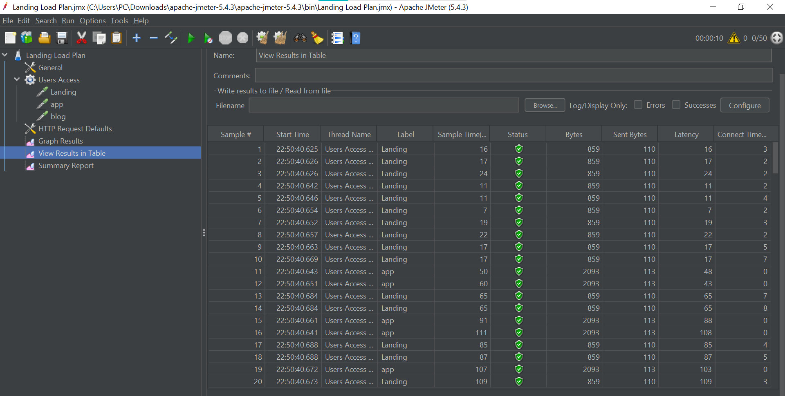
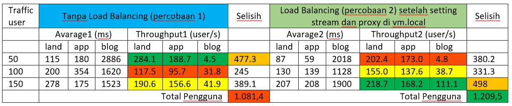

# Modul 4 - Web Server, Load Balancing dan uji performansi

Kelompok 7
Nama Anggota :
1. Rahmadina Oktaviana (1202190016)
2. Riska Aprilia (1202190007)
---
## Soal Praktikum
1. Terapkan loadbalancer untuk /blog dan /app dengan ketentuan
	1. /blog menggunakan least_conn
	2. /app menggunakan ip hash
	3. disarakan menggunakan ansible untuk instalasi
2. Gunakan apache Jmeter untuk menganalisa perbedaan antara /, /app, /blog dengan loadbalancer dan tanpa loadbalancer pada traffic 50, 100 dan 150 users. Analisa dari segi waktu saja. Tulis langkah testing dan analisa dengan bahasa sendiri.

---

## Soal Modul 4
- Pada latihan kita sudah melakukan konfigurasi pada ubuntu_landing
- Maka Step berikutnya yaitu melakukan konfigurasi yang sama terhadap ubuntu php7.4 dan debian_php5.6 yang akan dilaporkan sebagai berikut :

### Load Balancing
1. Siapkan LXC untuk ubuntu7.4
	* Clone LXC ubuntu_php7.4 menjadi ubuntu_php7.4_2 dan ubuntu_php7.4_3
	
		```sh
		sudo lxc-stop -n ubuntu_php7.4
		sudo lxc-copy -n ubuntu_php7.4 -N ubuntu_php7.4_2 -sKD
		sudo lxc-copy -n ubuntu_php7.4 -N ubuntu_php7.4_3 -sKD
		```
		
		
		
	* Start LXC 
	
		```sh
		sudo lxc-start -n ubuntu_php7.4
		sudo lxc-start -n ubuntu_php7.4_2
		sudo lxc-start -n ubuntu_php7.4_3
		```
		
		
		
	* Masuk ke lxc ubuntu_landing_2
	
		```sh
		sudo lxc-attach -n ubuntu_php7.4_2
		```
		
	* Configurasi IP dan nginx ubuntu_php7.4_2
	
		```sh
		nano /etc/netplan/10-lxc.yaml
		```
		
		
		
		ganti ip menjadi 10.0.3.111
		
		
		
		terapkan konfigurasi netplan baru
		
		```sh
		netplan apply
		```
		
		check ip
		
		```sh
		ip addr show eth0
		```
		
		
		
		Daftarkan domain lxc_php7_2.dev di hosts file
		
		```sh
		nano /etc/hosts
		```
		
		
		
		Konfigurasi nginx untuk lxc_php7.4_2.dev
		
		```sh
		nano /etc/nginx/sites-available/lxc_php7.dev
		```
		
		
		
		Check configurasi nginx dan start nginx
		
		```sh
		nginx -t
		service nginx restart
		```
		
		Coba akses lxc_php7
		
		```sh
		curl -i http://lxc_php7_2.dev
		```
		
		
		
		keluar dari ubuntu_landing_2
		
		```sh
		exit
		```
		
		
		
	* Masuk ke lxc ubuntu_php7.4_3
	
		```sh
		sudo lxc-attach -n ubuntu_php7.4_3
		```
		
	* Configurasi IP dan nginx ubuntu_php7.4_3
	
		```sh
		nano /etc/netplan/10-lxc.yaml
		```
		
		
		
		ganti ip menjadi 10.0.3.121
		
		
		
		terapkan konfigurasi netplan baru
		
		```sh
		netplan apply
		```
		
		check ip
		
		```sh
		ip addr show eth0
		```
		
		
		
		Daftarkan domain lxc_php7_3.dev di hosts file
		
		```sh
		nano /etc/hosts
		```
		
		
		
		Konfigurasi nginx untuk lxc_php7_3.dev
		
		```sh
		nano /etc/nginx/sites-available/lxc_php7.dev
		```
		
		
		
		Check configurasi nginx dan start nginx
		
		```sh
		nginx -t
		service nginx restart
		```
		
		Coba akses lxc_php7
		
		```sh
		curl -i http://lxc_php7_3.dev
		```
		
		
		
		exit dari ubuntu_php7.4_3
		
		```sh
		exit
		```
		
		
2. Siapkan LXC untuk debian_php5.6
	* Clone LXC debian_php5.6 menjadi debian_php5.6_2 dan debian_php5.6_3
	
		```sh
		sudo lxc-stop -n debian_php5.6
		sudo lxc-copy -n debian_php5.6 -N debian_php5.6_2 -sKD
		sudo lxc-copy -n debian_php5.6 -N debian_php5.6_3 -sKD
		```
		
		
		
	* Start LXC 
	
		```sh
		sudo lxc-start -n debian_php5.6
		sudo lxc-start -n debian_php5.6_2
		sudo lxc-start -n debian_php5.6_3
		```
		
		
		
		
	* Masuk ke lxc debian_php5.6_2
	
		```sh
		sudo lxc-attach -n debian_php5.6_2
		```
		
	* Configurasi IP dan nginx debian_php5.6_2
	
		```sh
		nano /etc/network/interfaces
		```
		
		
		
		ganti ip menjadi 10.0.3.112
		
		
		
		
		Daftarkan domain lxc_php5_2.dev di hosts file
		
		```sh
		nano /etc/hosts
		```
		
		
		
		Konfigurasi nginx untuk lxc_php5.6_2.dev
		
		```sh
		nano /etc/nginx/sites-available/lxc_php5.dev
		```
		
		
		
				
		keluar dari debian_php5.6_2
		
		```sh
		exit
		```
		
		
		
	* Masuk ke lxc debian_php5.6_3
	
		```sh
		sudo lxc-attach -n debian_php5.6_3
		```
		
	* Configurasi IP dan nginx debian_php5.6_3
	
		```sh
		nano /etc/network/interfaces
		```
		
		
		
		ganti ip menjadi 10.0.3.122
		
		
		
			
		Daftarkan domain lxc_php5_3.dev di hosts file
		
		```sh
		nano /etc/hosts
		```
		
		
		
		Konfigurasi nginx untuk lxc_php5.6_3.dev
		
		```sh
		nano /etc/nginx/sites-available/lxc_php5.dev
		```
		
		
		
		exit dari debian_php5.6_3
		
		```sh
		exit
		```
		

3. Daftarkan semua kontainer ke dalam `etc host` pada VM

	
	
	
	* Jalankan jmeter. Ganti angka pada box (number of threads) dari menu `user access` menjadi `50, 100, 150` . 

	* number of threads `50`
	
	
	
	
	
	
	
	* number of threads `100`

	
	
	
	
	
	
	* number of threads `150`

	
	
	
	
	

	* Konfigurasi load balancer menggunakan round robin (upstream) untuk halaman landing, php5, dan php7 `vm.local` pada nginx
	
		```sh
		sudo nano /etc/nginx/sites-available/vm.local
		```
		
		
		
		
		Ganti proxy_pass
		
		
		
	* Jalankan kembali jmeter dan ulangi kembali untuk Ganti angka pada box (number of threads) dari menu `user access` menjadi `50, 100, 150` . 
	
	* number of threads `50`
	
	
	
	
	
	
	
	* number of threads `100`

	
	
	
	
	
	
	* number of threads `150`

	
	
	
	
	
	
		
## Analisys

Berikut perbandingan antara penggunaan load balancer dan tidak


Dari tabel perbandingan di atas dapat disimpulkan bahwa perbedaan antara /, /app, /blog dengan loadbalancer dan tanpa loadbalancer pada traffic 50, 100 dan 150 users dari segi waktu :
- terdapat kestabilan pada traffic yang semakin tinggi dengan menggunakan loadbalancer maka semakin banyak pengguna yang mengakses website yaitu terjadi pada saat jmeter (setelah menambahkan stream pada vm.local) -> pada tabel terdapat pada bagian Average2 dan Troughput2 dengan traffic 150 users dimana akses web lebih cepat dan lebih banyak pengguna. 
- Sedangkan pada percobaan jmeter yang pertama terdapat ketidakstabilan dimana yang tanpa loadbalancer lebih banyak pengguna yang mengakses dilihat dari segi troughputnya yaitu pada traffic 50 user

Keterangan warna di tabel (berkaitan dengan pengguna yang mengakses persekon)
Warna merah : Sedikit
Warna kuning : Sedang
Warna hijau : Banyak


~ Terima Kasih ~
