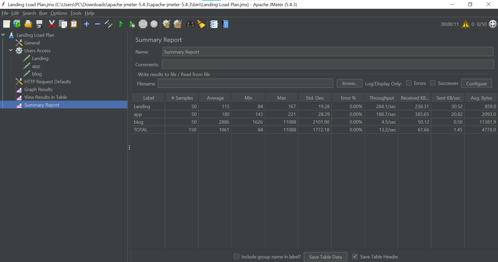

# Modul 4 - Web Server, Load Balancing dan uji performansi

Kelompok 7
Nama Anggota :
1. Rahmadina Oktaviana (1202190016)
2. Riska Aprilia (1202190007)
---


## Soal Modul 4
- Pada latihan kita sudah melakukan konfigurasi pada ubuntu_landing
- Maka Step berikutnya yaitu melakukan konfigurasi yang sama terhadap ubuntu php7.4 dan debian_php5.6 yang akan dilaporkan sebagai berikut :

### Load Balancing
1. Siapkan LXC untuk ubuntu7.4
	* Clone LXC ubuntu_php7.4 menjadi ubuntu_php7.4_2 dan ubuntu_php7.4_3
	
		```sh
		sudo lxc-stop -n ubuntu_php7.4
		sudo lxc-copy -n ubuntu_php7.4 -N ubuntu_php7.4_2 -sKD
		sudo lxc-copy -n ubuntu_php7.4 -N ubuntu_php7.4_3 -sKD
		```
		
		
		
	* Start LXC 
	
		```sh
		sudo lxc-start -n ubuntu_php7.4
		sudo lxc-start -n ubuntu_php7.4_2
		sudo lxc-start -n ubuntu_php7.4_3
		```
		
		
		
	* Masuk ke lxc ubuntu_landing_2
	
		```sh
		sudo lxc-attach -n ubuntu_php7.4_2
		```
		
	* Configurasi IP dan nginx ubuntu_php7.4_2
	
		```sh
		nano /etc/netplan/10-lxc.yaml
		```
		
		
		
		ganti ip menjadi 10.0.3.111
		
		
		
		terapkan konfigurasi netplan baru
		
		```sh
		netplan apply
		```
		
		check ip
		
		```sh
		ip addr show eth0
		```
		
		
		
		Daftarkan domain lxc_php7_2.dev di hosts file
		
		```sh
		nano /etc/hosts
		```
		
		
		
		Konfigurasi nginx untuk lxc_php7.4_2.dev
		
		```sh
		nano /etc/nginx/sites-available/lxc_php7.dev
		```
		
		
		
		Check configurasi nginx dan start nginx
		
		```sh
		nginx -t
		service nginx restart
		```
		
		Coba akses lxc_php7
		
		```sh
		curl -i http://lxc_php7_2.dev
		```
		
		
		
		keluar dari ubuntu_landing_2
		
		```sh
		exit
		```
		
		
		
	* Masuk ke lxc ubuntu_php7.4_3
	
		```sh
		sudo lxc-attach -n ubuntu_php7.4_3
		```
		
	* Configurasi IP dan nginx ubuntu_php7.4_3
	
		```sh
		nano /etc/netplan/10-lxc.yaml
		```
		
		
		
		ganti ip menjadi 10.0.3.121
		
		
		
		terapkan konfigurasi netplan baru
		
		```sh
		netplan apply
		```
		
		check ip
		
		```sh
		ip addr show eth0
		```
		
		
		
		Daftarkan domain lxc_php7_3.dev di hosts file
		
		```sh
		nano /etc/hosts
		```
		
		
		
		Konfigurasi nginx untuk lxc_php7_3.dev
		
		```sh
		nano /etc/nginx/sites-available/lxc_php7.dev
		```
		
		
		
		Check configurasi nginx dan start nginx
		
		```sh
		nginx -t
		service nginx restart
		```
		
		Coba akses lxc_php7
		
		```sh
		curl -i http://lxc_php7_3.dev
		```
		
		
		
		exit dari ubuntu_php7.4_3
		
		```sh
		exit
		```
		
		
2. Siapkan LXC untuk debian_php5.6
	* Clone LXC debian_php5.6 menjadi debian_php5.6_2 dan debian_php5.6_3
	
		```sh
		sudo lxc-stop -n debian_php5.6
		sudo lxc-copy -n debian_php5.6 -N debian_php5.6_2 -sKD
		sudo lxc-copy -n debian_php5.6 -N debian_php5.6_3 -sKD
		```
		
		
		
	* Start LXC 
	
		```sh
		sudo lxc-start -n debian_php5.6
		sudo lxc-start -n debian_php5.6_2
		sudo lxc-start -n debian_php5.6_3
		```
		
		
		
		
	* Masuk ke lxc debian_php5.6_2
	
		```sh
		sudo lxc-attach -n debian_php5.6_2
		```
		
	* Configurasi IP dan nginx debian_php5.6_2
	
		```sh
		nano /etc/network/interfaces
		```
		
		
		
		ganti ip menjadi 10.0.3.112
		
		
		
		
		Daftarkan domain lxc_php5_2.dev di hosts file
		
		```sh
		nano /etc/hosts
		```
		
		
		
		Konfigurasi nginx untuk lxc_php5.6_2.dev
		
		```sh
		nano /etc/nginx/sites-available/lxc_php5.dev
		```
		
		
		
				
		keluar dari debian_php5.6_2
		
		```sh
		exit
		```
		
		
		
	* Masuk ke lxc debian_php5.6_3
	
		```sh
		sudo lxc-attach -n debian_php5.6_3
		```
		
	* Configurasi IP dan nginx debian_php5.6_3
	
		```sh
		nano /etc/network/interfaces
		```
		
		
		
		ganti ip menjadi 10.0.3.122
		
		
		
			
		Daftarkan domain lxc_php5_3.dev di hosts file
		
		```sh
		nano /etc/hosts
		```
		
		
		
		Konfigurasi nginx untuk lxc_php5.6_3.dev
		
		```sh
		nano /etc/nginx/sites-available/lxc_php5.dev
		```
		
		
		
		exit dari debian_php5.6_3
		
		```sh
		exit
		```
		

	
	
	
	
	
	
	
	
	
	
	
	
	
	
	* etc host
	
	
	
	
	
	
	
	
	
	
	
	
	
	
	
	

	* Konfigurasi load balancer menggunakan round robin untuk halaman landing vm.local pada nginx
	
		```sh
		sudo nano /etc/nginx/sites-available/vm.local
		```
		
		
		
		
		
		
	* Jalankan kembali jmeter
	
	
	
	
	
	
	
	
	
	
	
	
	
	
	
	
	
	
	
	
## Soal Praktikum
1. Terapkan loadbalancer untuk /blog dan /app dengan ketentuan
	1. /blog menggunakan least_conn
	2. /app menggunakan ip hash
	3. disarakan menggunakan ansible untuk instalasi
2. Gunakan apache Jmeter untuk menganalisa perbedaan antara /, /app, /blog dengan loadbalancer dan tanpa loadbalancer pada traffic 50, 100 dan 150 users. Analisa dari segi waktu saja. Tulis langkah testing dan analisa dengan bahasa sendiri.

## Referensi
1. http://nginx.org/en/docs/http/load_balancing.html
2. https://jmeter.apache.org/
3. http://coding4ever.net/blog/2015/10/20/performance-test-menggunakan-jmeter/
4. https://www.youtube.com/watch?v=mXGcBvWYl-U
5. https://medium.com/doku-insight/jmeter-87cccc713733


