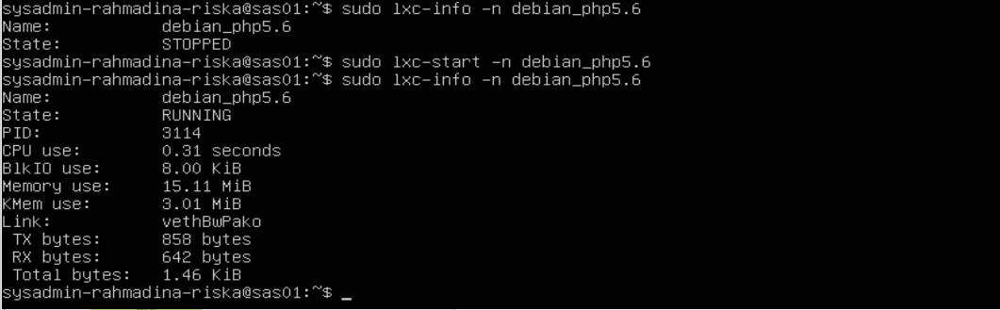

# Server Administration System - Practicum Module 1 Virtualization
___
### Report by :
Riska Aprilia       (1202190007)

Rahmadina Oktaviana (1202190016)
___
## Keadaan

Gilang dan Adit adalah sysadmin junior pada suatu perusahaan. Perusahaan tersebut akan membuat sebuah website company profile. Dimana website tersebut berisi 3 hal, yaitu company profile, blog dan aplikasi. CTO menjelaskan strategi domain yang akan digunakan, yaitu:

- vm.local
  - berisi landing page
- vm.local/blog
  - berisi blog
- vm.local/app
  - berisi aplikasi perusahaan

Setelah mendengarkan strategi domain dari CTO, Mereka mencoba membuat virtualisasi sederhana dengan skema dibawah ini :


Dari skema diatas, mereka mementukan bahwa lxc_php5.dev akan digunakan sebagai server aplikasi dan lxc_php7.dev akan digunakan sebagai server blog dan vm.local digunakan sebagai proxy server serta untuk web landing page. Lantas, mereka bertemu dengan tim programmer. Tim Programmer memberi tahu kepada mereka bahwa ada perubahan baru baru ini terkait ubuntu 16.04.


Karena hal ini, mereka berdiskusi dengan tim programmer dan menghasilkan suatu keputusan dimana skema yang akan dibuat adalah:


## Soal Praktikum

Dari skema diatas maka mereka akan melakukan pekerjaan sebagai berikut :

1. Rename ubuntu_php5.6 to ubuntu_landing, and change the IP following the new scheme 

   (Rename ubuntu_php5.6 menjadi ubuntu_landing, serta rubah IP mengikuti skema yang baru)
   * #### Langkah Pengerjaan Soal Praktikum
    a. menampilkan container tersedia sebelum melakukan rename ubuntu_php5.6


   ```bash
   sudo lxc-ls -f
   ```
    b. stop ubuntu_php5.6 sebelum melakukan rename, pastikan sudah dalam kondisi stopped dengan cek kembali list container
   ```bash
   lxc-stop ubuntu_php5.6
   lxc-ls -f
   ```
   *tampilan proses*
   
   
   c. merename ubuntu_php5.6 menjadi ubuntu_landing kemudian cek kembali list container yang tersedia
   ```bash
   sudo lxc-copy -R -n ubuntu_php5.6 -N ubuntu_landing
   lxc-ls -f
   ```
   *tampilan ubuntu_php5.6 telah terganti menjadi ubuntu_landing*

   

   **ubuntu_landing**

   d. start ubuntu_landing dan masuk ke attach container pada lxc
   ```bash
   sudo lxc-start -n ubuntu_landing
   lxc-attach -n ubuntu_landing
   ```
   
   e. set static IP
   ```bash
   nano /etc/network/interfaces
   ```
   
   Ganti IP address menjadi 10.0.3.103 sesuai konsep baru topologi jaringan untuk ubuntu_landing
   

   f. Lakukan restart setelah selesai mengubah IP apakah IP yang tadinya 102 sudah menjadi 103, jika belum maka lakukan perintah shutdown now, kemudian start kembali ubuntu landing dan masuk ke attach container dan cek ip kembali

   ```bash
   systemctl restart networking.service 
   atau
   shutdown now
   sudo lxc-start -n ubuntu_landing
   sudo lxc-attach -n ubuntu_landing
   ifconfig
   ```
   

2. Install lxc debian 9 with the name debian_php5.6 
  
   (Install lxc debian 9 dengan nama debian_php5.6)
   * #### Langkah Pengerjaan Soal Praktikum
   Bisa mengecek list container terlebih dahulu sebelum menginstall lxc debian 9 dengan nama debian_php5.6 agar dapat terlihat perbedaannya (pre n post)
   
   
   a. mengganti *sources list* ubuntu
   
   
   
   b. dengan memasukkan directory debian 9
   deb http://archive.debian.org/debian-non-US/ main contrib non-free
   deb-src http://archive.debian.org/debian-non-US/ main contrib non-free

   

   c. download debian dan buat lxc     
   
   
   
   
   
   


3. Setup nginx on debian_php5.6 for the http://lxc_php5.dev domain, create an index.html page that describes the lxc name information 

   (setup nginx pada debian_php5.6 untuk domain http://lxc_php5.dev , buat halaman index.html yang menerangkan informasi nama lxc)
   * #### Langkah Pengerjaan Soal Praktikum
   1. 

4. Setup nginx on ubuntu_landing for the http://lxc_landing.dev domain, create an index.html page that describes the lxc name information 

   (setup nginx pada ubuntu_landing untuk domain http://lxc_landing.dev , buat halaman index.html yang menerangkan informasi nama lxc)
   * #### Langkah Pengerjaan Soal Praktikum
   1. 

5. LXC ubuntu_landing should auto start when the vm is started, this is used to keep the company profile website from experiencing downtime
- Exit from directory lxc ubuntu_landing
    ```
    exit
    ```
   
- Stop and check status ubuntu_landing
    ```
    sudo lxc-stop -n ubuntu_landing
    lxc-ls -f
    ```
    

- Go in directory /var/lib/lxc and directory ubuntu_landing/config
    ```
    cd /vsr/lib/lxc
    ls
    cd ubuntu_landing
    ls
    nano config
    ```
   
   
  
- Autostart 1
    ```
    lxc.start.auto = 1
    ```
   

- Exit and check
    ```
    exit
    sudo lxc-ls -f
    ```
   

6. Setup nginx on vm.local to set proxy_pass where :
- Setting hosts
  ```
  sudo nano /etc/hosts
  ```
  
  

- Go in directory sites-available and vm.local
    ```
    cd /etc/nginx/sites-available
    ls
    sudo nano vm.local
    ```
   
   
   - accessing http://vm.local will redirect to http://lxc_landing.dev :
    ```
    location / {
        rewrite /?(.*)$ /$1 break;
        proxy_pass http://lxc_landing.dev;
    }
    ```

   - accessing http://vm.local/blog will redirect to http://lxc_php7.dev :
    ```
    location /blog {
        rewrite /blog/?(.*)$ /$1 break;
        proxy_pass http://lxc_php7.dev
    }
    ```
  
   - accessing http://vm.local/app will redirect to http://lxc_php5.dev :
    ```
    location /app {
        rewrite /app/?(.*)$ /$1 break;
        proxy_pass http://lxc_php5.dev;
    }
    ```

- Go in sites-enabled reset nginx
  ```
  cd ../sites-enabled
  ls -la
  sudo nginx -t
  sudo nginx -s reload
  ```
  

7. Access all three urls
- Test and check curl -i
  ```
  curl -i http://vm.local/
  curl -i http://vm.local/app
  curl -i http://vm.local/blog
  ```

- access http://vm.local/blog

  

- access http://vm.local/app

  

- access http://vm.local/

  
  
- Konfigurasi ip hosts 
  


8. Analisa
   
   - Why for php5.6 needs can't use ubuntu 16.04, so it needs to change the os to debian 9?
      - In April 2021, Ubuntu 16.04 Xenial will reach End of Standart Support and will be available only as a paid option through Ubuntu Extended Security Maintenance.
   - Why use LXC virtualization on the website schema that will be developed?
      - Because OS virtualization that allows us to run multiple Linux systems on one computer system at the same time. Of course this platform only applies to Linux only.
   - What is a proxy server? why can we think of vm.local as a proxy server?
     - A proxy server is a system that works as a network intermediary, for example when you access a website page, the proxy will request and receive information from the   website to the device you are using. There are different levels of security, information confidentiality, and functions depending on the type you use. Because we use it as a network intermediary between the virtual machine and localhost


